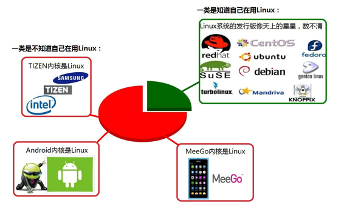
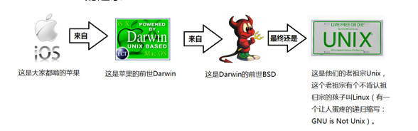

# Linux基础

#### 1.什么是操作系统

1）什么是操作系统？

　　操作系统是介于计算机和应用软件之间的一个软件系统，操作系统的上层和下层都有其他的对象存在：


2）操作系统的作用：

1.操作系统跟各种硬件打交道，翻译成硬件指令

2.提供了系统调用，进而使得应用程序可以通过系统调用进而使硬件功能。

#### 2.现实生活中的操作系统

1.Windows 

2.Mac 

3.Linux

4.Android

5.iOS

#### 3. 操作系统的发展史

#####Unix

1965年之前的时候，电脑并不像现在一样普遍，它可不是一般人能碰的起的，除非是军事或者学院的研究机构，而且当时大型主机至多能提供30台终端（30个键盘、显示器)，连接一台电脑


为了解决数量不够用的问题

1965年左后由贝尔实验室、麻省理工学院 以及 通用电气共同发起了Multics项目，想让大型主机支持300台终端1969年前后这个项目进度缓慢，资金短缺，贝尔实验室退出了研究

1969年从这个项目中退出的Ken Thompson当时在实验室无聊时，为了让一台空闲的电脑上能够运行“星际旅行”游戏，在8月份左右趁着其妻子探亲的时间，用了1个月的时间 编写出了 Unix操作系统的原型

1970年，美国贝尔实验室的 Ken Thompson，以 BCPL语言 为基础，设计出很简单且很接近硬件的 B语言（取BCPL的首字母），并且他用B语言写了第一个UNIX操作系统。

因为B语言的跨平台性较差，为了能够在其他的电脑上也能够运行这个非常棒的Unix操作系统，Dennis Ritchie和Ken Thompson 从B语言的基础上准备研究一个更好的语言

 

肯·汤普逊（左）和丹尼斯·里奇（右）

1972年，美国贝尔实验室的 Dennis Ritchie在B语言的基础上最终设计出了一种新的语言，他取了BCPL的第二个字母作为这种语言的名字，这就是C语言

1973年初，C语言的主体完成。Thompson和Ritchie迫不及待地开始用它完全重写了现在大名鼎鼎的Unix操作系统

 ##### Minix

因为AT&T(通用电气)的政策改变，在Version 7 Unix推出之后，发布新的使用条款，将UNIX源代码私有化，在大学中不再能使用UNIX源代码。Andrew S. Tanenbaum(塔能鲍姆)教授为了能在课堂上教授学生操作系统运作的实务细节，决定在不使用任何AT&T的源代码前提下，自行开发与UNIX兼容的操作系统，以避免版权上的争议。他以小型UNIX（mini-UNIX）之意，将它称为MINIX。

#####Linux

因为Minix只是教学使用，因此功能并不强，因此Torvalds（林纳斯·托沃兹）利用GNU的bash当做开发环境，gcc当做编译工具，编写了Linux内核-v0.02，但是一开始Linux并不能兼容Unix，即Unix上跑的应用程序不能在Linux上跑，即应用程序与内核之间的接口不一致，因为Unix是遵循POSIX规范的，因此Torvalds修改了Linux，并遵循POSIX（Portable Operating System Interface，他规范了应用程序与内核的接口规范）； 一开始Linux只适用于386，后来经过全世界的网友的帮助，最终能够兼容多种硬件


##### 操作系统的发展






#### 4.Linux的不同版本以及应用领域

#####1.Linux内核及发行版介绍

##### Linux内核版本

内核(kernel)是系统的心脏，是运行程序和管理像磁盘和打印机等硬件设备的核心程序，它提供了一个在裸设备与应用程序间的抽象层。

Linux内核版本又分为稳定版和开发版，两种版本是相互关联，相互循环：

- 稳定版：具有工业级强度，可以广泛地应用和部署。新的稳定版相对于较旧的只是修正一些bug或加入一些新的驱动程序。
- 开发版：由于要试验各种解决方案，所以变化很快。

内核源码网址：<http://www.kernel.org> 所有来自全世界的对Linux源码的修改最终都会汇总到这个网站，由Linus领导的开源社区对其进行甄别和修改最终决定是否进入到Linux主线内核源码中。

 ##### Linux发行版本

Linux发行版 (也被叫做 GNU/Linux 发行版) 通常包含了包括桌面环境、办公套件、媒体播放器、数据库等应用软件

#####2.应用领域

#####个人桌面领域的应用

此领域是传统linux应用最薄弱的环节，传统linux由于界面简单、操作复杂、应用软件少的缺点，一直被windows所压制，但近些年来随着ubuntu、fedora等优秀桌面环境的兴起，同时各大硬件厂商对其支持的加大，linux在个人桌面领域的占有率在逐渐的提高

典型代表：ubuntu、fedora、suse linux

#####服务器领域

linux在服务器领域的应用是其重要分支

linux免费、稳定、高效等特点在这里得到了很好的体现，但早期因为维护、运行等原因同样受到了很大的限制，但近些年来linux服务器市场得到了飞速的提升，尤其在一些高端领域尤为广泛

典型代表：

- Red Hat公司的AS系列
- 完全开源的debian系列
- suse EnterPrise 11系列等

#####嵌入式领域

近些年来linux在嵌入式领域的应用得到了飞速的提高

linux运行稳定、对网络的良好支持性、低成本，且可以根据需要进行软件裁剪，内核最小可以达到几百KB等特点，使其近些年来在嵌入式领域的应用得到非常大的提高

主要应用：机顶盒、智能电视、网络电话、程控交换机、手机、PDA、等都是其应用领域，得到了摩托罗拉、三星、NEC、Google等公司的大力推广


#### 5.文件和目录

#####Windows和Linux文件系统区别

在 windows 平台下，打开“计算机”，我们看到的是一个个的驱动器盘符：


在 Linux 下，我们是看不到这些驱动器盘符，我们看到的是文件夹（目录）：


ubuntu没有盘符这个概念，只有一个根目录/，所有文件都在它下面


Linux用户分为2种：

   	1. 超级管理员用户： root， 存放在目录/root
     2. 普通用户： 存放在目录/home下

#####Linux 目录

万物皆文件

- /：【*】根目录，一般根目录下只存放目录，在Linux下有且只有一个根目录。所有的东西都是从这里开始。当你在终端里输入“/home”，你其实是在告诉电脑，先从/（根目录）开始，再进入到home目录。
- /bin、/usr/bin: 【*】可执行二进制文件的目录，如常用的命令ls、tar、mv、cat等。
- /boot：放置linux系统启动时用到的一些文件，如Linux的内核文件：/boot/vmlinuz，系统引导管理器：/boot/grub。
- /dev：存放linux系统下的设备文件，访问该目录下某个文件，相当于访问某个设备，常用的是挂载光驱 mount /dev/cdrom /mnt。
- /etc：【*】系统配置文件存放的目录，不建议在此目录下存放可执行文件，重要的配置文件有 /etc/inittab、/etc/fstab、/etc/init.d、/etc/X11、/etc/sysconfig、/etc/xinetd.d。
- /home：【*】系统默认的用户家目录，新增用户账号时，用户的家目录都存放在此目录下，~ 表示当前用户的家目录，~ edu 表示用户 edu 的家目录。
- /lib、/usr/lib、/usr/local/lib：系统使用的函数库的目录，程序在执行过程中，需要调用一些额外的参数时需要函数库的协助。
- /lost+fount：系统异常产生错误时，会将一些遗失的片段放置于此目录下。
- /mnt: /media：光盘默认挂载点，通常光盘挂载于 /mnt/cdrom 下，也不一定，可以选择任意位置进行挂载。
- /opt：给主机额外安装软件所摆放的目录。
- /proc：此目录的数据都在内存中，如系统核心，外部设备，网络状态，由于数据都存放于内存中，所以不占用磁盘空间，比较重要的目录有 /proc/cpuinfo、/proc/interrupts、/proc/dma、/proc/ioports、/proc/net/* 等。
- /root：【*】系统管理员root的家目录。
- /sbin、/usr/sbin、/usr/local/sbin：放置系统管理员使用的可执行命令，如fdisk、shutdown、mount 等。与 /bin 不同的是，这几个目录是给系统管理员 root使用的命令，一般用户只能"查看"而不能设置和使用。
- /tmp：一般用户或正在执行的程序临时存放文件的目录，任何人都可以访问，重要数据不可放置在此目录下。
- /srv：服务启动之后需要访问的数据目录，如 www 服务需要访问的网页数据存放在 /srv/www 内。
- /usr：【*】应用程序存放目录，/usr/bin 存放应用程序，/usr/share 存放共享数据，/usr/lib 存放不能直接运行的，却是许多程序运行所必需的一些函数库文件。/usr/local: 存放软件升级包。/usr/share/doc: 系统说明文件存放目录。/usr/share/man: 程序说明文件存放目录。
- /var：【*】放置系统执行过程中经常变化的文件，如随时更改的日志文件 /var/log，/var/log/message：所有的登录文件存放目录，/var/spool/mail：邮件存放的目录，/var/run:程序或服务启动后，其PID存放在该目录下。


#####用户目录

位于/home/user，称之为用户工作目录或家目录,表示方式：

```shell
/home/user
~
```

#####相对路径和绝对路径

**绝对路径**

从/目录开始描述的路径为绝对路径，如：

```shell
cd /home/ijeff/abc/a.txt
ls /usr
cd ~
```

**相对路径**

从当前位置开始描述的路径为相对路径，如：

```
# . ..
cd ../../
ls abc/def
```

**.和..**

每个目录下都有.和..

. 表示当前目录

.. 表示上一级目录，即父目录

根目录下的.和..都表示当前目录


#### 常用基本命令

```
ls： list列出当前目录下的文件和文件夹
	ls -a : (-a表示-all）显示所有文件和文件夹，包括隐藏文件或隐藏文件夹（.开头的都是隐藏文件或文件夹）
pwd: 显示当前目录的绝对路径
cd: changedir改变目录（进入到指定目录）
	cd : 进入到当前家目录（~代表家目录）
	cd ~: 同上
	cd /root : 进入指定的目录（可以使用相对路径或绝对路径）
	cd .. :进入到上一层目录
	cd - : 返回到上一次的目录
touch: 创建空文件
vim: 编辑文件
	按下i：进入编辑模式，开始编辑文件内容
	然后按下esc：退出编辑模式，变成命令模式
	最后输入:wq 再按回车键: 保存并退出（w:表示保存文件内容，q:表示退出）
cat : 查看文件内容
mkdir : 创建文件夹
rm: 删除文件
rm -r ：删除文件夹
```

> tab: 自动补全

####6.文件权限

文件权限就是文件的访问控制权限，即哪些用户和组群可以访问文件以及可以执行什么样的操作。

Unix/Linux系统是一个典型的多用户系统，不同的用户处于不同的地位，对文件和目录有不同的访问权限。为了保护系统的安全性，Unix/Linux系统除了对用户权限作了严格的界定外，还在用户身份认证、访问控制、传输安全、文件读写权限等方面作了周密的控制。

在 Unix/Linux中的每一个文件或目录都包含有访问权限，这些访问权限决定了谁能访问和如何访问这些文件和目录。


####7.访问用户

通过设定权限可以从以下三种访问方式限制访问权限：

- 用户： 文件所有者。

- 用户组：允许一个预先指定的用户组中的用户访问（用户组） 用户都组合成用户组，例如，某一类或某一项目中的所有用户都能够被系统管理员归为一个用户组，一个用户能够授予所在用户组的其他成员的文件访问权限。

- 其他用户：允许系统中的任何用户访问（其他用户） 用户也将自己的文件向系统内的所有用户开放，在这种情况下，系统内的所有用户都能够访问用户的目录或文件。在这种意义上，系统内的其他所有用户就是 other 用户类

  ​

####8.访问权限

用户能够控制一个给定的文件或目录的访问程度，一个文件或目录可能有读、写及执行权限：

- 读权限（r） 对文件而言，具有读取文件内容的权限；对目录来说，具有浏览目录的权限。
- 写权限（w） 对文件而言，具有新增、修改，删除文件内容的权限；对目录来说，具有删除、移动目录内文件的权限。
- 可执行权限（x） 对文件而言，具有执行文件的权限；对目录了来说该用户具有进入目录的权限。

注意：通常，Unix/Linux系统只允许文件的属主(所有者)或超级用户改变文件的读写权限。

 

```python
# 文件详情
-rw-rw-r--  1 ijeff ijeff   21 11月  4 16:19 aa.txt

- rw-rw-r--  : 文件权限
第1个表示：文件类型，-表示文件
第2~10个表示权限， 分成3组：rw- rw- r--
第一组：表示文件所属用户的权限（rw-表示：可读可写不可执行）
第二组：表示文件所属用户组的权限，用户所属组的其他用户的权限（rw-表示：可读可写不可执行）
第三组：表示其他组用户的权限（r--表示只读，不可写不可执行）

```


第1个字母代表文件的类型：

```
“d” 代表文件夹、
“-” 代表普通文件、
“l” 代表软链接文件、
“c” 代表硬件字符设备、
“b” 代表硬件块设备、
“s” 表示管道文件、
```

后 9 个字母分别代表三组权限：文件所有者、用户组、其他用户拥有的权限。

每一个用户都有它自身的读、写和执行权限。

- 第一组权限控制访问自己的文件权限，即所有者权限。
- 第二组权限控制用户组访问其中一个用户的文件的权限。
- 第三组权限控制其他所有用户访问一个用户的文件的权限。

这三组权限赋予用户不同类型（即所有者、用户组和其他用户）的读、写及执行权限就构成了一个有9种类型的权限组。


