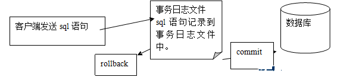
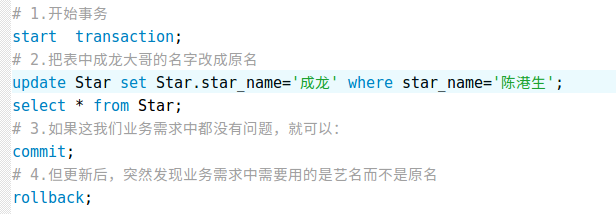

# 索引和事务

### 一， 索引

#### 1.索引介绍

```
索引看着挺高大上的一个名字，说白了就是我们一本书最前面的目录。

假如你用新华字典来查找“张”这个汉字，不使用目录的话，你可能要从新华字典的第一页找到最后一页，可能要花二个小时。字典越厚呢，你花的时间就越多。现在你使用目录来查找“张”这个汉字，张的首字母是z，z开头的汉字从900多页开始，有了这条线索，你查找一个汉字可能只要一分钟，由此可见索引的重要性。

索引用于快速找出在某个列中有一特定值的行。

不使用索引，MySQL必须从第1条记录开始然后读完整个表直到找出相关的行。表越大，花费的时间越多。如果表中查询的列有一个索引，MySQL能快速到达一个位置去搜寻到数据文件的中间，没有必要看所有数据。

当然索引也不易过多，索引越多写入，修改的速度越慢。因为，写入修改数据时，也要修改索引。

MySQL中，所有数据类型的列都可以被索引，常用的存储引擎InnoDB和MyISAM能支持每个表创建16个索引。InnoDB和MyISAM使用的索引其底层算法是B-tree（B树），B-tree是一种自平衡的树，类似于平衡二叉排序树，能够保持数据有序。这种数据结构能够让查找数据、顺序访问、插入数据及删除的操作都在对数时间内完成。
```

#### 2.索引分类

| 索引类型 | 功能说明                                     |
| :--- | ---------------------------------------- |
| 普通索引 | 最基本的索引，它没有任何限制                           |
| 唯一索引 | 某一列启用了唯一索引则不准许这一列的行数据中有重复的值。针对这一列的每一行数据都要求是唯一的  unique |
| 主键索引 | 它是一种特殊的唯一索引，不允许有空值。一般是在建表的时候同时创建主键索引，常用于用户ID。类似于书中的页码  primary key |
| 全文索引 | 对于需要全局搜索的数据，进行全文索引                       |

#### 3.查看索引

```
基本语法：
	show index from tablename;
示例：
	show index from user\G;
示例说明：
	查看user表的索引结构
```

#### 4.普通索引

```
基本语法：
	alter table 表 add index(字段)
示例：
	alter table money add index(username);
示例说明：
	为money表的username字段增加索引
```

####  5.唯一索引

```
基本语法：
	alter table 表 add unique(字段)
示例：
	alter table money add unique(email);
示例说明：
	为money表的email字段增加唯一索引
```

####  6.主键索引

```
基本语法：
	alter table 表 add primary key(字段)
示例：
	alter table money add primary key(id);
示例说明：
	为money表的id字段增加主键索引
```

#### 7.创建表时声明索引

```
创建表时可在创建表语句后加上对应的类型即可声明索引：

primary key(字段) 
index (字段)
unique (字段)

create table user (
	id int auto_increment,
	name varchar(20),
	primary key(id),
	unique (name)
);

```

#### 8.删除索引

```
基本语法：
	ALTER TABLE table_name DROP INDEX index_name
示例：
	alter table money drop index age;
示例说明：
	为money表删除age索引
```


### 二， 事务

#### 1.事务控制语言(DTL)

```
我们每执行一条SQL语句,每执行一组SQL语句,我们都可以称为事务
如果一组SQL语句里,某一个SQL语句失败了,称为整个事务的失败,因此出现这种情况必须要恢复到正常的情况上才能没有问题.
在逛淘宝的时候，购买了某一个货品钱付了,但淘宝服务器刚好断电了,商家没办法收到你的钱,就不发货。 担保交易银行中转帐的时候, 款已经扣除了,但突然断电,导致对方收不到钱.

如果有了事务，就可以避免该事情。
事务可以看作是一个“容器”，将多条语句，放入该容器，最后，只要一个命令行，来决定其中的所有语句是否“执行” 
```

#### 2.事务的四大特征

```
在 MySQL 中只有使用了 Innodb 数据库引擎的数据库或表才支持事务。
	事务处理可以用来维护数据库的完整性，保证成批的 SQL 语句要么全部执行，要么全部不执行。
	事务用来管理 insert,update,delete 语句

一般来说，事务是必须满足4个条件（ACID）：
		原子性（Atomicity） 事务作为一个整体被执行，包含在其中的对数据库的操作要么全部被执行，要么都不执行
		一致性（Consistency）事务应确保数据库的状态从一个一致状态转变为另一个一致状态
		隔离性（Isolation）多个事务并发执行时，一个事务的执行不应影响其他事务的执行
		持久性（Durability）已被提交的事务对数据库的修改应该永久保存在数据库中

```


#### 3.事务的原理

##### 传统的情况：


##### 事务的机制:




#### 4.事务模式

```
在mysql中默认一条sql语句一个事务
因此,如果需要开启事务模式的话
使用 start transaction开头,开启事务模式
使用 commit 语句执行后,才能真正生效
使用 rollback 语句进行回滚
```

#### 5.事务的流程

| 执行语句                    | 说明                                       |
| ----------------------- | ---------------------------------------- |
| start transaction       | 执行开始事务命令后,下面将进入事务模式.                     |
| update、delete、insert 操作 | 在事务执行后,这些操作只在内存状态下进行,而不是在物理状态下           |
| commit                  | 在事务执行完成后,确认执行无误且成功,就可以使用commit把内存中执行的结果,提交到物理内存中 |
| rollback                | 如果在事务执行过程中,发生了错误,则可以使用rollback命令回滚到上一个事务操作 |

#### 6.事务的使用




