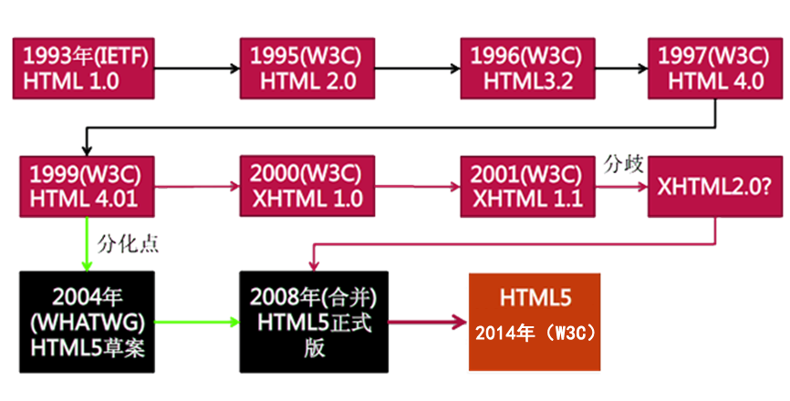
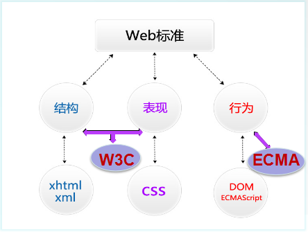
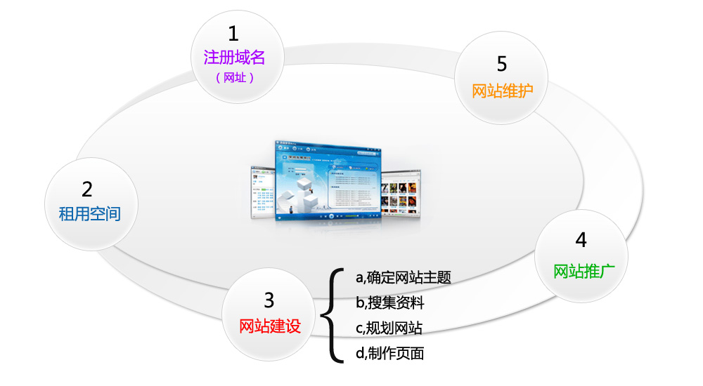
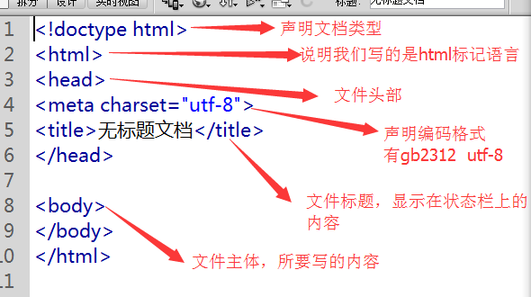

## 第1天_HTML基础

### 1. 学习目标

- HTML相关概念，HTML发展历史
- WEB标准，W3C/ECMA相关概念
- 相关软件的应用以及站点的创建
- HTML基本结构和HTML语法
- HTML常用标记

### 2. HTML相关概念，HTML发展历史

#### 2.1 HTML及相关概念的介绍

​        HTML 指的是超文本标记语言 (Hyper Text Markup Language) 万维网的描述性语言。

XHTML指可扩展超文本标记语言（标识语言）（EXtensible HyperText Markup Language）是一种置标语言，表现方式与超文本标记语言（HTML）类似，不过语法上更加严格。

HTML5指的是HTML的第五次重大修改（第5个版本）(HTML5 是 W3C 与 WHATWG 合作的结果)

#### 2.2 HTML发展历史



### 3. WEB标准、W3C/ECMA相关概念

#### 3.1 WEB标准的概念及组成



#### 3.2 组织解析：

- W3C( World Wide Web Consortium )万维网联盟，创建于1994年是Web技术领域最具权威和影响力的国际中立性技术标准机构。W3C (制定了结构(html)和表现(css)的标准，非赢利性的。)


- ECMA(European Computer Manufactures Association) 欧洲电脑场商联合会。ECMA制定了行为(DOM(文档对象模型)，ECMAScript)标准 

### 4. 相关软件的应用以及站点的创建

#### 4.1 站点的作用

- 用来归纳一个网站上所有的网页、素材以及他们之间的联系
- 规划网站的所有内容和代码 整合资源

#### 4.2 创建站点的步骤

- 创建网页所需各个文件夹 css、js、images、html、font

#### 4.3 文件的命名规则

- 文件命名规则：用英文，不用中文
- 名称全部用小写英文字母、数字、下划线的组合，其中不得包含汉字、空格和特殊字符；必须以英文字母开头。

#### 4.4. 网站建站流程  



### 5. HTML基本结构和HTML基本语法

#### 5.1 HTML基本结构



#### 5.2 HTML的基本语法

> **双标记/常规标记**
> <标记 属性=“属性值” 属性=“属性值”></标记>
> 例如：<head></head>

> **单标记/空标记**
> <标记 属性=“属性值” />
> 例如：<meta charset="utf-8" > 

##### 说明：

1. 写在<>中的第一个单词叫做标记，标签，元素。
2. 标记和属性用空格隔开，属性和属性值用等号连接，属性值必须放在“”号内。
3. 一个标记可以没有属性也可以有多个属性，属性和属性之间不分先后顺序。
4. 空标记没有结束标签，用“/”代替。

### 6. HTML常用标记

#### 6.1 文本标题(h1~h6)  

```html
<h1>一级标题</h1>
<h2>二级标题</h2>
<h3>二级标题</h3>
<h4>二级标题</h4>
<h5>二级标题</h5>
<h6>六级标题</h6>

seo: 搜索引擎优化的一种技术
```

#### 6.2 段落文本(p)  

```html
<p>段落文本内容</p>
```

标识一个段落(段落与段落之间有段间距)

#### 6.3 空格  

```html
&nbsp;
```

所占位置没有一个确定的值,这与当前字体字号都有关系.

#### 6.4 换行(br)

```html
<br />
```

换行是一个空标记(强制换行)

#### 6.5 加粗(b,strong)

```html
<b>加粗内容</b>
<strong>加粗内容</strong>
```

#### 6.6 倾斜(em,i)

```html
<em>倾斜内容</em> 
<i>倾斜内容</i>
```

#### 6.7 水平线(hr)

```html
<hr /> 
```

#### 6.8 列表(ul,ol,dl)

**HTML中有三种列表分别是：无序列表，有序列表，自定义列表**

- 无序列表ul(unordered list)


```html
 <ul>
 	<li></li>
 	<li></li>
 	．．．
 </ul>
```
- 有序列表ol(ordered list)


```html
 <ol>
 	<li></li>
 	<li></li>
 	．．．
 </ol>
```
- 自定义列表dl(definition list)


```html
 <dl>
 	<dt>名词</dt>
 	<dd>解释definition description</dd>
 	．．．
 </dl>
```
- 知识扩展： 有序列表的属性

  - type: 规定列表中的列表项目的项目符号的类型

    语法：

    ```html
    <ol type="a"></ol>
    ```

    说明：

    - 1 数字顺序的有序列表（默认值）（1, 2, 3, 4）。
    - a 字母顺序的有序列表，小写（a, b, c, d）。
    - A 字母顺序的有序列表，大写（A,B,C,D)
    - i 罗马数字，小写（i, ii, iii, iv）。
    - I 罗马数字，大写（I, ii, iii, iv）。

  - start 属性规定有序列表的开始点。

    语法：

    ```html
    <ol start="5"></ol>
    ```
#### 6.9 插入图片(img)
```html

```

- title的作用: 

  在你鼠标悬停在该图片上时显示一个小提示，鼠标离开就没有了，HTML的绝大多数标签都支持title属性，title属性就是专门做提示信息的

- alt的作用:

  alt属性是在你的图片因为某种原因不能加载时在页面显示的提示信息，它会直接输出在原本加载图片的地方

  针对seo,百度会去收录alt属性中的关键字,如果有收录,那么在Imgae.baidu.com中所有相对应的 关键字,就能出现自己网站的图片

- 相对路径的写法：

  - 当当前文件与目标文件在同一目录下，写法如下： 

  ```html
  直接书写目标文件文件名+扩展名: 
  ```

  - 当当前文件与目标文件所处的文件夹在同一目录下，写法如下:

  ```html
  文件夹名/目标文件全称+扩展名；
  ```

  - 当当前文件所处的文件夹和目标文件所处的文件夹在同一目录下，写法如下：

  ```html
  ../目标文件所处文件夹名/目标文件文件名+扩展名: 
  ```

#### 6.10 超链接(a)

```html
<a href="目标文件路径及全称/连接地址" title="提示文本">链接文本/图片</a>
<a href="#">空链接</a>   
<a href="#" target="_blank">新页面打开</a>
```

说明：

- href 属性 若果是空值或者是#,那么点击该链接跳到当前页面的最顶端,例如

  ```
  <a href="#">空链接</a>
  <a href="">空链接</a>
  ```

  

- target: 页面打开方式，默认属性值_self

- _blank: 新窗口打开

#### 6.11 表格(table)

```html
<table width="value" height="value" border="value" bgcolor="value" cellspacing="value" cellpadding="value">
	<tr>
		<td></td>
		<td></td>
	</tr>
</table>
```

- 说明：

  - 一个tr表示一行; 

  - 一个td表示一列(一个单元格)

- 表格的相关属性：

  - width="表格的宽度"
  - height="表格的高度"
  - border="表格的边框"
  - bgcolor="表格的背景色" bg=background
  - bordercolor="表格的边框颜色"
  - cellspacing="单元格与单元格之间的间距"
  - cellpadding="单元格与内容之间的空隙"
  - 对齐方式：align="left/center/right";

  合并单元格属性：

  - colspan=“所要合并的单元格的列数"合并列;
  - rowspan=“所要合并单元格的行数”合并行;

#### 6.12 表单(form)

- 表单的作用：

  用来收集用户的信息的;

- 表单框

```html
<form method="post/get" action="表单提交链接">
	<input type="text" name="username" />
	<input type="password" name="password" />
    <input type="submit" />
</form>
```

- 单行文本框

```html
<input type="text" value="按钮内容" placeholder="默认提示文字" />
```

- 密码框

```html
<input type="password" placeholder="请输入密码" />
```

- 按钮

```html
<input type="button" value="按钮" />
<button>按钮</button>
<input type="submit" value=“按钮内容” />
```
- 单选框

```html
<input type="radio" name="like" value="code" disabled/>
<input type="radio" name="like" value="english" checked />
```

说明：同一组单选框的name属性值必须一样， 相同name的单选框只能选择一个

​	checked: 默认选中

​	disabled: 禁用


- 复选框


```html
<input type="checkbox" name="like" value="code"/>
<input type="checkbox" name="like" value="english" checked="checked" />
```

说明：同一组复选框的name属性值必须一样， 相同name的复选框可以选择多个

- 下拉菜单

```html
<select name="like">
	<option selected>菜单内容</option>
	<option>菜单内容</option>
	<option>菜单内容</option>
</select>
```

说明： 

​	selected： 默认选中

- 文本域

```html
<textarea name="textareal" cols="字符宽度" rows="行数">
</textarea>
```

#### 6.13 div和span的用法

```html
<div></div>
```

说明： 

- 块标签，没有具体含义
- 用来设置文档区域，是文档布局常用标签
- 块状元素意义: 不管给这个元素设置多宽的像素,这个元素始终独占一行

```html
<span></span>
```

说明：

- 内联标签
- 可以是某一小段文本，或是某一个字。
- 内联标签的意义:
  - 标签的宽度是内容所占长度,不能用css去设置
  - 在每个元素后面去显示

#### 6.14 扩展知识点

```html
<form name="表单名称" method="post/get" action=""></form>
```

form中的获取数据的两个方式get和post的区别：

- get主要是从服务器上获取数据，post主要是向服务器传送数据
- get是把参数数据队列加到提交表单的action属性所指的url中，值和表单内各个字段一一对应，在url中可以看到; post是通过HTTP post机制，将表单内各个字段与其内容放置在HTML header 内一起传送到action属性所指的URL地址, 用户看不到这个过程, 安全性相对get较高
- get传送的数据量较小，不能大于2KB； post传送的数据量较大，一般被默认为不受限制
- get安全性非常低，post安全性较高
- get执行效率比post方法好

建议：

- get方式的安全性较post方式要差些，包含机密信息的话，建议用post数据提交方式；
- 在做数据查询时，建议用get方式；而在做数据添加、修改或删除时，建议用post方式；


##### pre标签: 按照在html中文本输入的样式,按照原样显示

比如

```html
<pre>
	你好
</pre>
```

