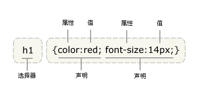
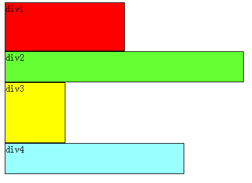
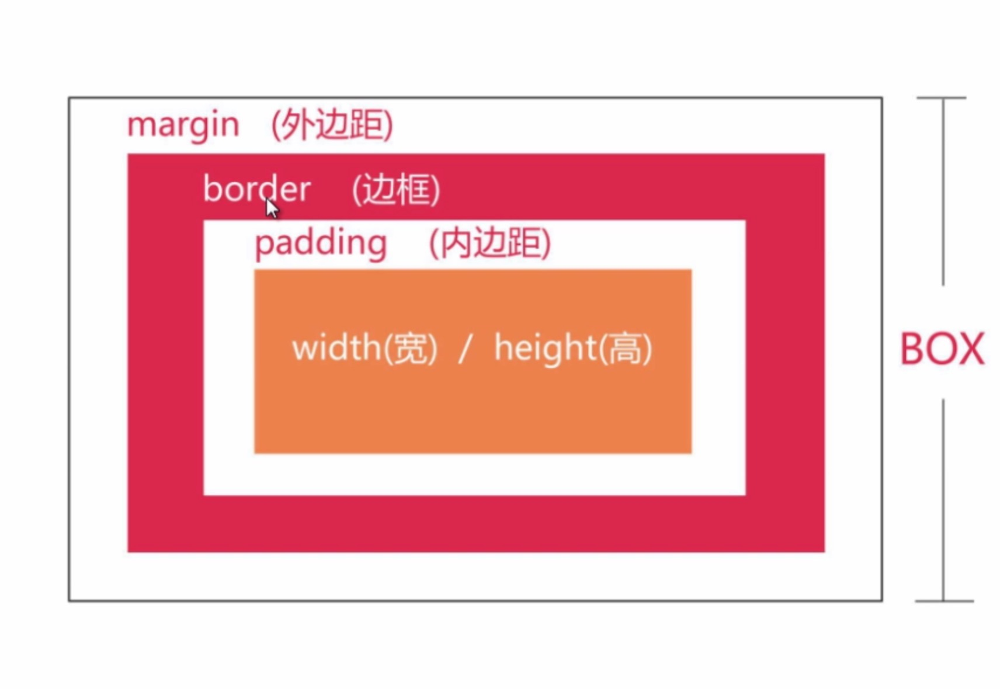

## 第2天_CSS基础

### 1. 学习目标

- CSS简介和CSS语法
- 引入CSS的三种方式及优先级
- CSS选择器及选择器的权重
- 浮动及清浮动
- CSS核心属性
- CSS盒子模型

### 2. CSS简介和CSS语法

#### 2.1 CSS 简介

​	CSS英文全名：Cascading Style Sheets层叠样式表, WEB标准中的表现标准语言, 表现标准语言在网页中主要对网页信息的显示进行控制，简单说就是如何修饰网页信息的显示样式。
目前推荐遵循的是W3C发布的CSS3.0

#### 2.2 CSS语法

- CSS语法：选择器 {属性：属性值；属性：属性值；}



- 说明：
  - 每个CSS样式由两部分组成，即选择器和声明，声明又分为属性和属性值；
  - 属性必须放在花括号中，属性与属性值用冒号连接。
  - 每条声明用分号结束。
  - 当一个属性有多个属性值的时候，属性值与属性值不分先后顺序。
  - 在书写样式过程中，空格、换行等操作不影响属性显示。

### 3. 引入CSS的三种方式及优先级

#### 3.1 引入CSS的三种方式

- 内部样式
  - 语法：

    ```css
    <style type="text/css">
        /*css语句*/
    </style>
    ```

  - 说明：

    使用style标记创建样式时，最好将该标记写在`<head></head>`;

- 外部样式

  - 语法

    ```css
    <link rel="stylesheet" type="text/css" href="目标文件的路径及文件名全称" />
    ```

  - 说明：

    使用link元素导入外部样式表时，需将该元素写在文档头部，即`<head></head>` 中间。

    rel（relation）：用于定义文档关联，表示关联样式表；

    type：定义文档类型；

- 内联样式 （或称：行间样式，行内样式，嵌入式样式）

  ```html
  <标签 style="属性：属性值;属性:属性值;"></标签>
  ```

#### 3.2 样式表的优先级

- 内联样式表的优先级别最高
- 内部样式表与外部样式表的优先级和书写的顺序有关，后书写的优先级别高。

### 4. CSS选择器及选择器的权重

#### 4.1 CSS选择器

- ##### 标签选择器/元素选择器

  语法：

  ​	标签名 {属性：属性值；}

  说明：

  - 标签选择器就是以文档语言对象类型作为选择器，即使用结构中元素名称作为选择器
  - 所有的页面元素都可以作为选择器

- ##### id选择器

  语法：

  ​	id名 {属性：属性值;}

  说明：

  - 当我们使用id选择器时，应该为每个元素定义一个id属性

    如：`<div id="box"></div>`

  - id选择器的语法格式是“#”加上自定义的id名

    如：`#box{width:300px; height:300px;}`

  - 起名时要取英文名，不能用关键字：(所有的标记和属性都是关键字)

    如：head标记

  - 一个id名称只能对应文档中一个具体的元素对象，因为id只能定义页面中某一个唯一的元素对象。id是唯一值

  - 最大的用处：创建网页的外围结构。

- ##### class选择器

  语法：

  ​	.class名 {属性：属性值;}

  说明：

  - 当我们使用class选择器时，应先为每个元素定义一个类名称
  - class选择器的语法格式是：如：`<div class="top"></div>`

  用法：

  ​	页面中应大量使用class选择器定义样式；

  ​	class的值是可以重复的

- ##### 通配符

  语法：

  ​	*{属性：属性值；}
  说明：

  ​	通配选择器的写法是“*”，其含义就是所有元素。
  用法：

  ​	常用来重置样式。

- ##### 群组选择器

  语法：

  ​	选择器1，选择器2，选择器3{属性：属性值;}

  说明：

  ​	当有多个选择器应用相同的样式时，可以将选择器用“，”分隔的方式，合并为一组。

- ##### 包含选择器

  语法：

  ​	选择器1 选择器2{属性：属性值;}
  说明：

  ​	选择器1和选择器2用空格隔开，含义就是选择器1中包含的所有选择器2;

- ##### 伪类选择器

  语法 ：
  ​	a:link{属性：属性值;}超链接的初始状态;
  ​	a:visited{属性：属性值;}超链接被访问后的状态;
  ​	a:hover{属性：属性值;}鼠标悬停，即鼠标划过超链接时的状态;
  ​	a:active{属性：属性值;}超链接被激活时的状态，即鼠标按下时超链接的状态;
  说明：

  - 当这4个超链接伪类选择器联合使用时，应注意他们的顺序，正常顺序为：

    a:link,a:visited,a:hover,a:active,错误的顺序有时会使超链接的样式失效；

  - 为了简化代码，可以把伪类选择器中相同的声明提出来放在a选择器中；

    例如：a{color:red;} a:hover{color:green;} 表示超链接的三种状态都相同，只有鼠标划过变颜色。

#### 4.2 CSS选择器的权重

CSS中用四位数字表示权重，权重的表达方式如：0，0，0，0

- 标签选择符的权重为0001
- class选择符的权重为0010
- id选择符的权重为0100
- 属性选择符的权重为0010
- 伪类选择符的权重为0010
- 包含选择符的权重：为包含选择符的权中之和
- 内联样式的权重为1000

权重:  内联 > id > class > 元素标签

说明：

- 当不同选择器的样式设置有冲突的时候，高权重选择器的样式会覆盖低权重选择器的样式。

  ​	例如：b.demo的权重是1+10=11
  ​		      .demo的权重是10
  ​	所以经常会发生.demo的样式失效

- 相同权重的选择器，样式遵循就近原则：哪个选择器最后定义，就采用哪个选择器样式。

### 5 浮动及清浮动

#### 5.1 浮动的使用

- 语法：

  float: none/left/right;

- 三个取值：

  left:元素活动浮动在文本左面
  ​right:元素浮动在右面
  ​none:默认值，不浮动。

- 浮动的目的：

  就是让竖着的东西横着来

- 示例：

  如下图， 首先要知道，div是块级元素，在页面中独占一行，自上而下排列，也就是传说中的流
  

  可以看出，即使div1的宽度很小，页面中一行可以容下div1和div2，div2也不会排在div1后边，因为div元素是独占一行的

  注意：

  以上这些理论，是指标准流中的div。

  无论多么复杂的布局，其基本出发点均是：“如何在一行显示多个div元素”。

  显然标准流已经无法满足需求，这就要用到浮动。

  ##### 浮动可以理解为让某个div元素脱离标准流，漂浮在标准流之上，和标准流不是一个层次。


#### 5.2 清浮动

元素浮动之前，也就是在标准流中，是竖向排列的，而浮动之后可以理解为横向排列
清除浮动可以理解为打破横向排列。
清除浮动的关键字是clear，语法：
clear : none | left | right | both
​	none  :  默认值。允许两边都可以有浮动对象
​	left   :  不允许左边有浮动对象
​	right  :  不允许右边有浮动对象
​	both  :  不允许有浮动对象

> 对于CSS的清除浮动(clear)，一定要牢记：这个规则只能影响使用清除的元素本身，不能影响其他元素。

### 6. CSS核心属性

#### 6.1 CSS文本属性

- 文本大小：

  {font-size: value;}

  说明：

  - 属性值为数值型时，必须给属性值加单位，属性值为0时除外。
  - 单位还可以是pt，9pt=12px

- 文本颜色：

  {color:颜色值;}

- 文本字体：

  {font-family: 字体1，字体2，字体3;}

  说明：

  - 浏览器首先会寻找字体1、如在字体1不存在的情况下，则会寻找字体2，如字体2也不存在，按字体3显示内容，如果字体3 也不存在；则按系统默认字体显示；

- 文字加粗

  {font-weight: bolder(更粗的)/bold（加粗）/normal（常规）/100—900;}
  说明：

  - 在css规范中，把字体的粗细分为9个等级，分别为100——900，其中100对应最轻的字体变形，而900对应最重的字体变形，

  - 100-400 一般

    500常规字体
    600-900加粗字体

- 文字倾斜 

  {font-style：italic/oblique/normal（取消倾斜，常规显示);}
  说明：

  - italic和oblique都是向右倾斜的文字, 但区别在于Italic是指斜体字，而Oblique是倾斜的文字，对于没有斜体的字体应该使用Oblique属性值来实现倾斜的文字效果.

- 水平对齐方式

  {text-align:left/right/center/justify（两端对齐中文不起作用）;}

- 文字行高 {line-height:normal/value;}

  说明：

  - 当单行文本的行高等于容器高时，可实现单行文本在容器中垂直方向居中对齐；

- 文本修饰

  {text-decoration:none/underline/overline/line-through;}
  说明：

  - none:没有修饰
  - underline:添加下划线
  - overline:添加上划线
  - line-through:添加删除线

- 首行缩进：

  {text-indent:value;}

  说明：

  - text-indent可以取负值；
  - text-indent属性只对第一行起作用。

- 字间距

  {letter-spacing:value;}

  说明： 

  - 控制英文字母或汉字的字距。（英文字母和字母）
  
  

#### 6.2 css列表属性

- 定义列表符号样式

  list-style-type：disc(实心圆)/circle(空心圆)/square(实心方块)/none(去掉列表符号)；

- 使用图片作为列表符号

  list-style-image：url(所使用图片的路径及全称)；

- 去掉列表符号

  list-style:none;

#### 6.3 css背景属性

- 背景颜色

  语法：

  ​	background-color:颜色值;

- 背景图片的设置

  语法：

  ​	background-image：url(背景图片的路径及全称)；

  说明：

  - 网页上有两种图片形式：插入图片、背景图；
  - 插入图片：属于网页内容，也就是结构。
  - 背景图：属于网页的表现，背景图上可以显示文字、插入图片、表格等。

- 背景图片的显示原则:

  - 容器尺寸等于图片尺寸，背景图片正好显示在容器中
  - 容器尺寸大于图片尺寸，背景图片将默认平铺，直至铺满元素；
  - 容器尺寸小于图片尺寸，只显示元素范围以内的背景图。

- 背景图片平铺属性

  语法：

  ​	background-repeat:no-repeat/repeat/repeat-x/repeat-y 

  说明：

  ​	no-repeat:不平铺
  ​	repeat：平铺
  ​	repeat-x：横向平铺
  ​	repeat-y ：纵向平铺

- 背景图的固定

  语法：

  ​	{background-attachment:scroll(滚动)/fixed(固定);

  说明：

  - fixed； 固定，不随内容一块滚动；
  - scroll: 随内容一块滚动。

- 背景图片的位置

  语法：

  ​	{background-position:left/center/right/数值 top/center/bottom/数值;}

  说明：

  - 水平方向上的对齐方式（left/center/right）或值
  - 垂直方向上的对齐方式(top/center/bottom)或值
  - background-position:值1 值2;
    - 两个值 ：第一个值表示水平位置的值，第二个值：表示垂直的位置。
    - 当两个值都是center的时候写一个值就可以代表的是水平位置和垂直位置
    - 向左方向，向上方向是负值

### 7. 盒子模型

#### 7.1认识盒子模型

  - 盒模型是css布局的基石，它规定了网页元素如何显示以及元素间相互关系。css定义所有的元素都可以拥有像盒子一样的外形和平面空间，即都包含边框、边界、补白、内容区，这就是盒模型。

#### 7.2 盒子模型的相关元素

- 边框属性border

    - 语法：

      {border: 边框宽度 边框风格 边框颜色;}

    - 例如：

      {border:5px solid #ff0000;}
      说明：

      ​	边框宽度：border-width
      ​	边框样式：border-style:solid(实线)/dashed(虚线)dotted(点划线)double(双线)

      ​	边框颜色：border-color

    - 可单独设置一方向边框

      border-bottom:边框宽度 边框风格 边框颜色;底边框
      border-left:边框宽度 边框风格 边框颜色;左边框
      border-right:边框宽度 边框风格 边框颜色;右边框
      border-top:边框宽度 边框风格 边框颜色;上边框

  - 内边距padding

    - 语法： 

      四个值：上 右 下 左 {padding:0px 0px 0px 40px;}

      三个值：上 左右 下 {padding:10px 20px 30px ;}

      二个值：上下 左右 {padding:10px 20px ;}

      一个值：四个方向 padding:2px;/*定义元素四周填充为2px*/

    - 说明：可单独设置一方向填充，如：上方向padding-top:10px; 右方向padding-right:10px; 下方向padding-bottom:10px; 左方向padding-left:10px;
    - 用法：
      - 用来调整内容在容器中的位置关系
      - 用来调整子元素在父元素中的位置关系。
      - padding属性需要添加在父元素上。
      - padding值是额外加在元素原有大小之上的，如想保证元素大小不变，需从元素宽或高上减掉后添加的padding属性值

  - 外边距margin 

    - 语法： 

      四个值：上 右 下 左

      三个值：上 左 右 下

      二个值：上下 左 右

      一个值：四个方向 如：margin:2px;

    - 说明：

      - 可单独设置一方向边界，如：margin-top:10px; 

        margin-left:左边界

        margin-right:右边界

        margin-top:上边界

        margin-bottom:下边界

    - 居中：

      margin:0 auto;  


### 7.3 盒子的实际大小

- 宽 =左右margin+左右border+左右padding+width，

- 高 =上下margin+上下border+上下padding+height，

  - 例如：一个盒子的 margin 为 20px，border 为 1px，padding 为 10px，content 的宽为 200px、高为 50px，

  - 宽=margin*2 + border*2 + padding*2 + content.width = 20*2 + 1*2 + 10*2 +200 = 262px，

  - 高=margin*2 + border*2 + padding*2 + content.height = 20*2 + 1*2 +10*2 + 50 = 112px





